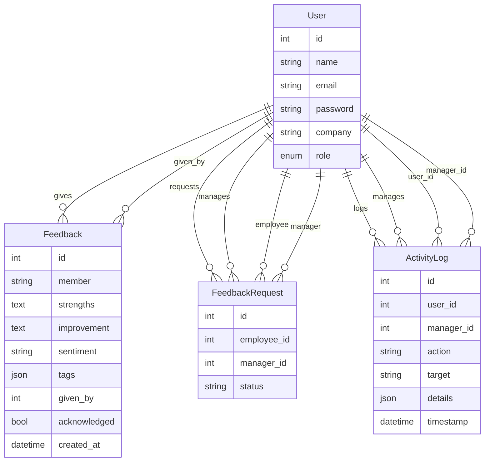

# Workplace Vibe

## Project Overview
Workplace Vibe is a comprehensive platform designed to foster a positive and productive work environment by enabling continuous feedback, sentiment analysis, and transparent activity tracking within organizations. The system empowers both employees and managers to share feedback, monitor sentiment trends, and maintain a log of workplace activities, all through an intuitive web interface.

---

## Features
- **Employee & Manager Roles:** Distinct dashboards and permissions for employees and managers.
- **Feedback System:** Employees and managers can give, request, and acknowledge feedback.
- **Sentiment Analysis:** Automatic sentiment tagging of feedback for trend visualization.
- **Activity Logging:** All significant actions are logged for transparency and analytics.
- **Secure Authentication:** Token-based authentication for secure access.
- **Modern UI:** Responsive React frontend for a seamless user experience.

---

## Technology Stack
- **Frontend:** React (JavaScript)
- **Backend:** FastAPI (Python)
- **Database:** SQLite (via SQLAlchemy ORM)
- **API Communication:** REST (JSON)
- **Authentication:** Custom middleware (token-based)

---

## Setup Instructions

### Prerequisites
- Node.js (v14+ recommended)
- Python 3.8+
- (Optional) Virtual environment tool (venv, virtualenv)

### 1. Clone the Repository
```sh
git clone <your-repo-url>
cd workplace_vibe
```

### 2. Backend Setup

```sh
cd backend
# (Optional) Create and activate a virtual environment
python -m venv venv
source venv/bin/activate  # On Windows: venv\Scripts\activate

# Install dependencies
pip install -r requirements.txt

# Run the FastAPI server
uvicorn main:app --reload
```
- The backend will start at `http://127.0.0.1:8000` by default.
- The SQLite database file (`workplace_vibe.db`) is created in the backend directory.
- API documentation is available at `http://127.0.0.1:8000/docs`.

### 3. Frontend Setup

```sh
cd ../frontend
npm install
npm start
```
- The frontend will start at `http://localhost:3000` by default.
- It communicates with the backend API at `http://127.0.0.1:8000` (adjust if needed).

---

## Usage
- **Login/Register:** Users can register and log in as either employees or managers.
- **Give Feedback:** Users can provide feedback to colleagues, including strengths, areas for improvement, and tags.
- **Request Feedback:** Managers can request feedback for employees.
- **View Sentiment Trends:** Visualize feedback sentiment over time.
- **Activity Log:** View a history of actions performed in the system.

---

## Design Decisions
- **Monorepo Structure:** Both backend and frontend are in a single repository for easier development and deployment.
- **FastAPI:** Chosen for its speed, async support, and automatic OpenAPI docs.
- **React:** For a modern, component-based UI and rich ecosystem.
- **SQLite:** Lightweight, file-based DB for easy local development. Can be swapped for PostgreSQL/MySQL in production.
- **Custom Auth Middleware:** Simple token-based authentication for demonstration; can be replaced with OAuth/JWT for production.
- **Separation of Concerns:** Models, schemas, routers, and middleware are organized in dedicated folders for maintainability.
- **Extensibility:** The system is designed to be easily extended with new features, such as advanced analytics or third-party integrations.

---

## Folder Structure
```
workplace_vibe/
  backend/      # FastAPI backend
  frontend/     # React frontend
```

---

## Entity Relationship Diagram (ERD)


