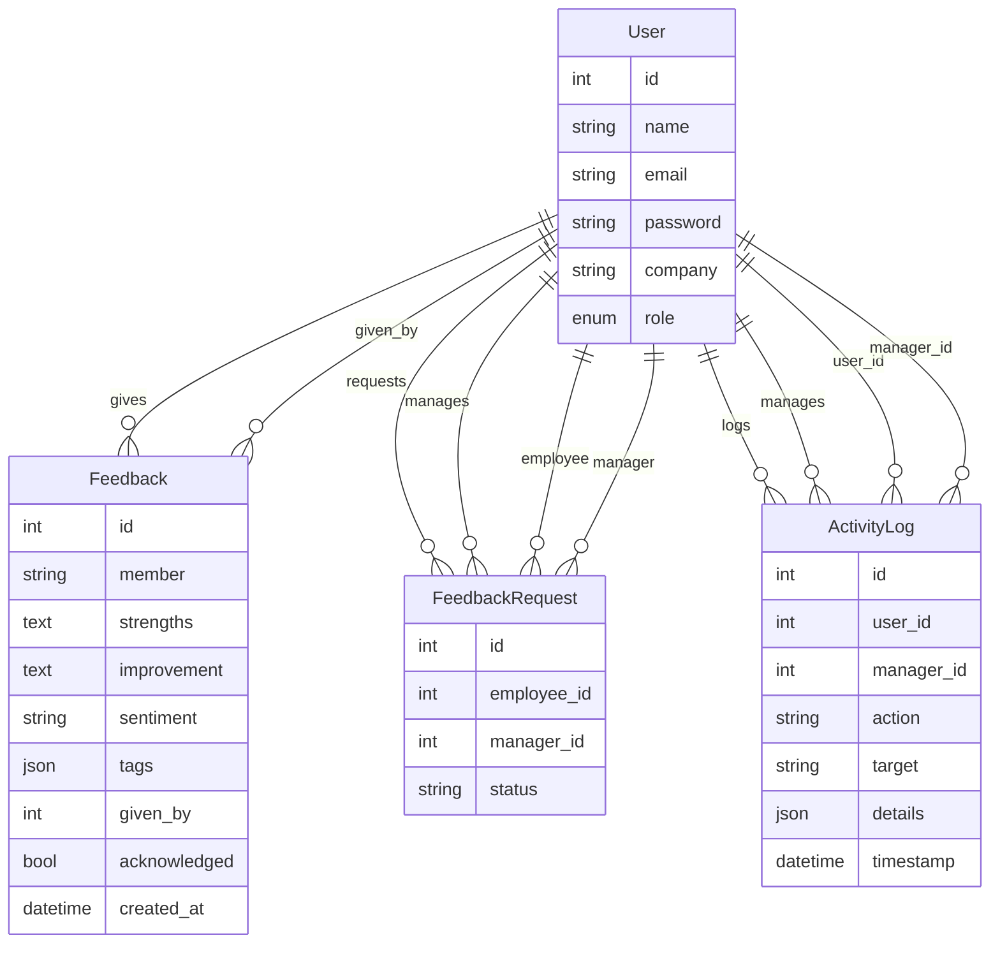

# Workplace Vibe

## Project Overview
Workplace Vibe is a full-stack application designed to collect, analyze, and visualize employee feedback and sentiment trends within an organization. It consists of a Python FastAPI backend and a React frontend.

---

## Stack

- **Frontend:** React (JavaScript)
- **Backend:** FastAPI (Python)
- **Database:** SQLite (via SQLAlchemy ORM)
- **API Communication:** REST (JSON)
- **Authentication:** Custom middleware (token-based)

---

## Setup Instructions

### Prerequisites
- Node.js (v14+ recommended)
- Python 3.8+
- (Optional) Virtual environment tool (venv, virtualenv)

### 1. Clone the Repository
```sh
git clone <your-repo-url>
cd workplace_vibe
```

### 2. Backend Setup

```sh
cd backend
# (Optional) Create and activate a virtual environment
python -m venv venv
source venv/bin/activate  # On Windows: venv\Scripts\activate

# Install dependencies
pip install -r requirements.txt

# Run the FastAPI server
uvicorn main:app --reload
```

- The backend will start at `http://127.0.0.1:8000` by default.
- The SQLite database file (`workplace_vibe.db`) is created in the backend directory.

### 3. Frontend Setup

```sh
cd ../frontend
npm install
npm start
```

- The frontend will start at `http://localhost:3000` by default.
- It communicates with the backend API at `http://127.0.0.1:8000` (adjust if needed).

---

## Design Decisions

- **Monorepo Structure:** Both backend and frontend are in a single repository for easier development and deployment.
- **FastAPI:** Chosen for its speed, async support, and automatic OpenAPI docs.
- **React:** For a modern, component-based UI and rich ecosystem.
- **SQLite:** Lightweight, file-based DB for easy local development. Can be swapped for PostgreSQL/MySQL in production.
- **Custom Auth Middleware:** Simple token-based authentication for demonstration; can be replaced with OAuth/JWT for production.
- **Separation of Concerns:** Models, schemas, routers, and middleware are organized in dedicated folders for maintainability.

---

## Folder Structure

```
workplace_vibe/
  backend/      # FastAPI backend
  frontend/     # React frontend
```

---

## Entity Relationship Diagram (ERD)



---

## Contact
For questions or contributions, please open an issue or pull request.